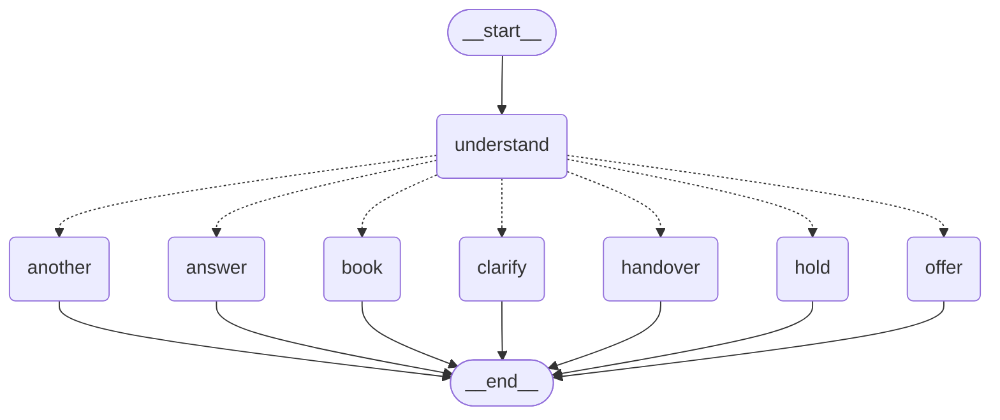

# Conversational booking agent

An agent that takes booking calls for a diagnostic clinic. Somebody says "I need
an MRI of the knee", and between that and an appointment there are questions to
ask, an exam to identify out of several that answer to the same word, a slot to
hold while they decide, and a set of situations where the right thing to do is
to stop and fetch a person.

It runs with no account, no API key and no model. Type at it:

```
pip install -r requirements.txt
python -m tools.talk
```

```
  agent : You are through to Example Clinic. What can I book for you?

  you   : knee

  agent : Did you mean MRI knee or X-ray knee?

  you   : the mri one

  agent : Left or right?

  you   : left, no contrast

  agent : And what name should I put it under?

  you   : Anna Bianchi

  agent : I have these:
          1) Monday 07 September at 09:00
          2) Monday 07 September at 09:15
          3) Monday 07 September at 09:30
          Which suits you?

  you   : the second

  agent : Anna Bianchi: MRI knee left without contrast, on Monday 07 September
          at 09:15. Shall I book that?

  you   : yes

  agent : Booked: Anna Bianchi: MRI knee left without contrast, Monday
          07 September at 09:15. Your reference is M6H-FWV.
```

The same call on the telephone, with `python -m tools.talk --voice`:

> The first is Monday the seventh of September at nine o'clock in the morning.
> The second is Monday the seventh of September at nine fifteen in the morning.
> […] Your reference is M 6 H dash F W V. That is M 6 H dash F W V, once more.

## What it is careful about

**It does not guess.** Two exams answer to "knee", so it asks which. An
exam that has a left and a right is not booked without one. Not understanding
is an answer, and it is the answer that ends with a person on the line — an
agent that guesses produces a confident booking for the wrong thing, and the
caller finds out on the day.

**A slot offered is a slot held.** A conversation takes minutes. Between "there
is a nine o'clock on Tuesday" and "yes, that one" somebody checks with their
partner and finds their prescription. Without a hold, two people are told about
the same slot and one of them arrives to find it gone.

**It knows what it may not do.** CT angiography is in the catalogue so it can be
found and explained, not hidden so the clinic looks as if it does not do it —
and it is handed to somebody who can arrange it, with the reason. Somebody
ringing about an appointment they already have gets a person, because the agent
has no way to know they are who they say they are.

**It gives up on purpose.** Two turns of not being understood, three sets of
times nobody likes, nothing free in a fortnight: each one ends with a named
reason and a note the person taking over can read before they say hello. "The
agent gave up" is not something anybody can act on.

**A reference is for the person it is given to.** Two groups of three, from an
alphabet with no O or I — heard as zero and one — no 0, 1, 5 or 8 — heard back
as O, I, S and B — and no vowels, so six random characters cannot spell
anything the clinic would rather read out. Out loud it is spelled and then
repeated. It used to be the first twelve characters of a uuid: unique, correct,
and unusable by the person it was for.

## How it is put together

```
booking_agent/
  clinic/        what is offered, and when it is free
    catalogue.py   exams, and the search from what somebody said
    diary.py       sessions, free slots, holds, bookings
    build.py       a clinic from the file that describes one
  conversation/  what to say next
    state.py       what is known so far, and what is still missing
    reading.py     what one message appears to mean
    graph.py       the flow, as a LangGraph graph
  channels/      how to say it
    chat.py        for a screen
    voice.py       for somebody who cannot look back
  service/       the outside world, and the only clock in the building
```

Nothing above imports anything below it, and [a
test](tests/test_service.py) fails if a domain package ever learns the word
`fastapi`. The direction of that dependency is the design, and it is exactly
the kind of thing one convenient import undoes.

### The conversation graph



Drawn by `python -m tools.diagram`, from the graph rather than from memory —
[a test](tests/test_diagram.py) fails if a node is added here and forgotten
there, because a hand-drawn picture of a graph is accurate exactly once.

Every node ends the turn. The graph is entered once per message and not run to
completion, because a booking conversation does not finish on its own: it
waits, and waiting is its normal state. What each node does is one thing —
`clarify` asks for exactly one missing piece, `hold` keeps a slot, `handover`
writes the note the person taking over will read.

Three consequences worth naming:

- **The flow is one function.** `_route` in `graph.py` is the whole of what the
  agent decides, top to bottom, and every node can be run against a state built
  by hand in three lines. The thing this replaces had one node with two and a
  half thousand lines inside it, which is a way of saying it had no graph at
  all.
- **Nothing reads the clock.** The time is passed in everywhere below
  `service/`, so a hold running out mid-sentence is a three-line test rather
  than a ten-minute wait.
- **Language is in one file.** `reading.py` is the only part with an opinion
  about what English means. The default reader is rules, not a placeholder for
  a model: a demonstration that needs a key before it does anything is a
  demonstration nobody runs, and logic that can only be exercised through a
  model is logic that is not tested.

## Checking it

```
python -m unittest discover -s tests -t .   # the tests
python -m tools.transcripts                 # whole conversations
python -m tools.transcripts --show          # and read them
```

The tests were written alongside the code they test, which makes them good at
saying it still does what it did and poor at saying it does what a caller
needs. So `data/conversations/` holds whole calls — one caller line per line —
and the tool reports only how each one ended: booked, handed to a person with a
reason, answered, or **stuck**, which means the agent went round in circles.

The first time it ran, four of the eight were stuck, against seventy passing
tests. Among what it found: a synonym reading "scan of the tummy" had put the
words *of* and *the* into an exam's vocabulary, so a caller who said "it's
about the thing" was understood to want an abdominal ultrasound and was asked
for their name. Point it at your own folder with `python -m tools.transcripts
path/to/folder`.

## The service

```
python -m booking_agent.service      # http://127.0.0.1:8000/docs
```

Localhost only, with no default that reaches further.

| | |
|---|---|
| `POST /calls` | start one. `{"channel": "chat"}` or `"voice"` |
| `POST /calls/{call}/said` | `{"text": "..."}` → the reply, the stage, whether it is over |
| `GET /calls/{call}` | where it has got to, without moving it on |
| `DELETE /calls/{call}` | hang up |

Calls are held in memory and let go of after an hour of silence. The booking is
the thing worth keeping, and the diary already has it.

## The clinic

`data/clinic.json` describes a clinic that does not exist. It is deliberately
untidy, because a tidy catalogue demonstrates nothing: an exam that needs both
a side and a contrast, two that answer to "knee", one the agent may not book,
one longer than some of the sessions in the diary, one modality with a single
room. [A test](tests/test_build.py) fails if somebody tidies it up.

Replace it with your own and pass it to either entry point with `--clinic`.

## What it does not do

No model, no speech, no telephony, and no database — a restart forgets the
diary. Reading is rules, which is enough for the sentences in
`data/conversations/` and will not survive everything a real switchboard hears;
the `Reader` protocol in `reading.py` is one method wide, so a model-backed
reader is a new class and no change to anything else. That was the point of
putting the boundary there.

---

Developed by Riccardo Sapuppo. MIT licensed.
