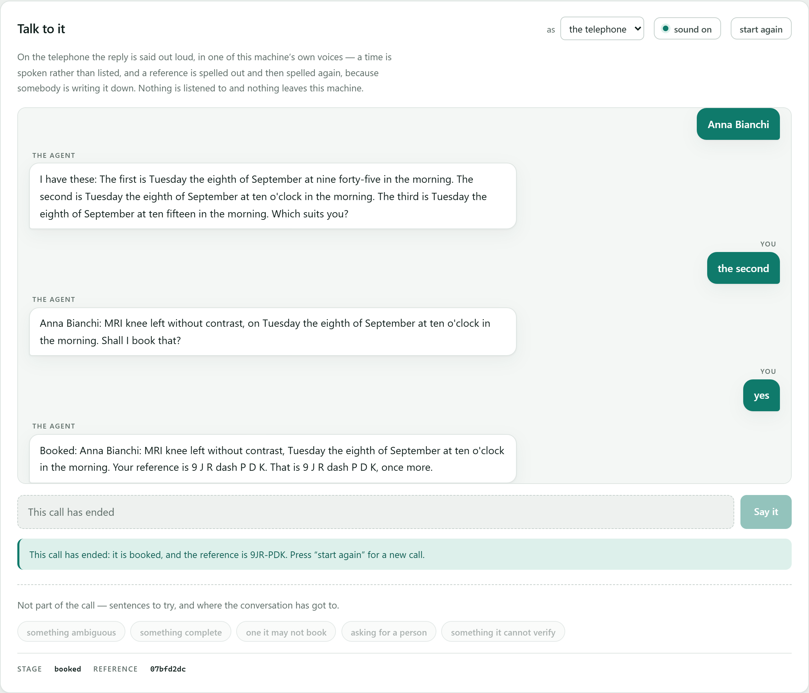
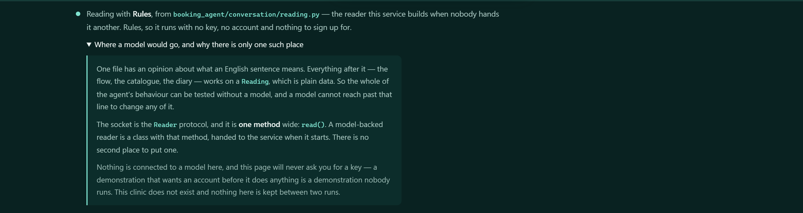

# Conversational booking agent

An agent that takes booking calls for a diagnostic clinic. Somebody says "I need
an MRI of the knee", and between that and an appointment there are questions to
ask, an exam to identify out of several that answer to the same word, a slot to
hold while they decide, and a set of situations where the right thing to do is
to stop and fetch a person.

## Before you start

**Python 3.10 or newer**, and nothing else. No database, no message broker, no
container, no account, no API key, and no model: the agent runs on rules, which
is a decision rather than a stage it has not reached yet.

Check what you have with `python --version`. On Windows the command is often
`py` rather than `python`; on Linux and macOS it may be `python3`.

**Measured, not estimated:** the five pinned packages bring **43 distributions**
in with them and take **49 MB** on disk, installed once from PyPI. That is the
entire network cost: nothing reaches out again afterwards, at any point, for
any reason.

**Install into a virtual environment** (`python -m venv .venv`, then activate
it) so that undoing all of this is deleting `.venv/` and the clone. Nothing
here writes outside its own folder, registers a service, or touches anything
global.

## Running it

```
git clone https://github.com/riccardosapuppo/conversational-booking-agent
cd conversational-booking-agent
pip install -r requirements.txt

python -m booking_agent.service
```

That opens the console on <http://127.0.0.1:8000>: the agent, and the clinic it
is booking in, as the two sides of one desk.


**Two sides, one at a time, each labelled with whose it is.** The *caller's
side* is the conversation and nothing else, because that is all somebody
ringing up has. The *clinic's side* is the catalogue, the diary and what has
been booked, because that is what the people answering are looking at while
they talk. The two used to sit next to each other on one screen, which read
well and was nobody's view of anything, because a caller cannot see the diary
and the people with the diary open are not the ones being spoken to. Which side
you are on is in the address, `#caller` or `#desk`, so a reload leaves you where
you were and a link opens where you sent it.

Crossing over is the argument. An agent offering "Monday at 09:15" is only
interesting if you can go and look at the diary, see that 09:15 was free, book
it, and watch it stop being free. The exam list is searched with **the agent’s
own search**, not a filter written for the screen, which would be a second thing
to keep in step and the one that quietly stopped agreeing.

**Nothing on that page books anything.** Every booking goes through the
conversation, which is where the rules that guard it live; a screen with its own
path to the diary would be the path nobody tested. The views the clinic's side
reads are read-only, and a test tries every other verb on each of them.

The browser is not opened in CI, with no terminal attached, or with `--no-open`
(or `NO_OPEN=1`), and it says which of those happened.

### Or at a prompt

```
python -m tools.talk
```

Five packages are installed, all of them pinned in
[requirements.txt](requirements.txt): LangGraph for the conversation graph,
FastAPI, uvicorn and pydantic for the HTTP service, and httpx for the tests and
for the telephony adapter, which calls this service the way anything else does.
It said four until somebody counted the file. Then type at it:

```
  agent : You are through to Kesterby Diagnostic Centre. What can I book
          for you?

  you   : knee

  agent : Did you mean MRI knee or X-ray knee?

  you   : the mri one

  agent : Left or right?

  you   : left, no contrast

  agent : And what name should I put it under?

  you   : Anna Bianchi

  agent : I have these:
          1) Monday 07 September at 09:00
          2) Monday 07 September at 09:15
          3) Monday 07 September at 09:30
          Which suits you?

  you   : the second

  agent : Anna Bianchi: MRI knee left without contrast, on Monday 07 September
          at 09:15. Shall I book that?

  you   : yes

  agent : Booked: Anna Bianchi: MRI knee left without contrast, Monday
          07 September at 09:15. Your reference is M6H-FWV.
```

The same call on the telephone, with `python -m tools.talk --voice`:

> The first is Monday the seventh of September at nine o'clock in the morning.
> The second is Monday the seventh of September at nine fifteen in the morning.
> […] Your reference is M 6 H dash F W V. That is M 6 H dash F W V, once more.

On the console that reply is **said out loud**, and down a real telephone line
it is what a switchboard is handed to speak. Both are further down.

## What it is careful about

**It does not guess.** Two exams answer to "knee", so it asks which. An
exam that has a left and a right is not booked without one. Not understanding
is an answer, and it is the answer that ends with a person on the line, because
an agent that guesses produces a confident booking for the wrong thing and the
caller finds out on the day.

**A slot offered is a slot held.** A conversation takes minutes. Between "there
is a nine o'clock on Tuesday" and "yes, that one" somebody checks with their
partner and finds their prescription. Without a hold, two people are told about
the same slot and one of them arrives to find it gone.

**It knows what it may not do.** CT angiography is in the catalogue so it can be
found and explained, not hidden so the clinic looks as if it does not do it, and
it is handed to somebody who can arrange it, with the reason. Somebody
ringing about an appointment they already have gets a person, because the agent
has no way to know they are who they say they are.

**It gives up on purpose.** Two turns of not being understood, three sets of
times nobody likes, nothing free in a fortnight: each one ends with a named
reason and a note the person taking over can read before they say hello. "The
agent gave up" is not something anybody can act on.

**A reference is for the person it is given to.** Two groups of three, from an
alphabet with no O or I (heard as zero and one), no 0, 1, 5 or 8 (heard back as
O, I, S and B), and no vowels, so six random characters cannot spell anything
the clinic would rather read out. Out loud it is spelled and then repeated. It
used to be the first twelve characters of a uuid: unique, correct, and unusable
by the person it was for.

## The console

Until it existed, the only way to see this agent work was to install Python and
type at a prompt, which meant most people who might want to see it never would.
It is the same agent over the same endpoints, with the clinic's side one switch
away from the conversation. Three things on the two of them are worth looking
at.

**What is free, for how long.** A diary is only free *for something*: thirty
minutes free does not mean an exam needing forty-five fits there. So the length
is a control rather than an assumption, and changing it changes what is offered.


**What it has booked, and what that cost the diary.** Book something on the
caller's side and it appears here; the time it took stops being offered.


**Where it stops.** A handover is not an error and is not drawn as one. It is
the agent doing the most useful thing available to it, and the reason travels
with it.


A handover also **ends the call**, and the page now ends with it. The service
has always been clear about this — every reply carries `over`, and anything said
on a finished call comes back as a 409 with a sentence saying which state it is
in — but the console read straight past it: the input went on inviting a
sentence, the service refused it, and a bubble appeared with nothing in it at
all. So the input closes when the conversation does, the page says which ending
it was, and "start again" is the way on. And whatever comes back that is not a
reply (a refusal, a fallen network) fills the waiting bubble, in the service's
own words. A bubble that promises words and produces none says the agent had
nothing to say, which was never true.

One more thing about that bubble: it goes up the moment a message is sent, and
the reply is worked out in single milliseconds, so it was being filled inside
the same frame it was drawn in and the wait was never once visible. It now
stands for half a second at the least (a floor and not a delay) on every route
into the transcript: the request leaves immediately and a slower answer is never
held back for it.

### The telephone, out loud

The first question this page got asked was what the difference between *chat*
and *the telephone* was supposed to be. That question was the answer. In
`voice.py` the difference is substantial: a numbered list becomes sentences
because "one close paren" is not a word, `09:00` becomes "nine o'clock in the
morning" because "seven" on its own gets somebody to a clinic twelve hours
early, and the reference is spelled out and then spelled again because there is
no scrolling back to something you are half way through writing down. In a
browser, all of that was one piece of text replacing another, read by somebody
who could look back at it whenever they liked. The work was real and the
evidence was not.

So on the telephone **the reply is spoken**, in one of the machine's own
voices. `speechSynthesis` is in the browser already: no key, no account, no
request and no microphone. Nothing is listened to, nothing leaves the machine,
and the page says so where the choice is made. What was a caption is
now a thing you hear, including the reference said twice, which is the one part
of `voice.py` that reads as fussy on a screen and is obviously right in the ear.



Four details, because the naive version of this is worse than not doing it:

- **It can be silenced, and the silence is remembered.** Somebody who opens a
  page that starts talking closes it, and making them silence it again on every
  reload is that insult twice. The choice is kept per browser.
- **It never speaks first.** Browsers refuse speech until a page has been
  interacted with, so a greeting spoken on arrival would be swallowed without a
  word: a feature that half works is worse than one that is off. The page
  therefore only ever speaks as the direct result of something pressed:
  choosing the telephone, sending a sentence, starting again. That is not a
  workaround for the policy, it is the behaviour you would want anyway.
- **It stops when the conversation moves on.** A new sentence cuts off whatever
  was still being said, when the sentence is sent, not when the reply lands,
  because the alternative is the agent talking over the caller.
- **Where there is no `speechSynthesis` there is no sound control**, no
  promise of one, and a page otherwise exactly as it was.

The voices arrive asynchronously (`getVoices()` is empty on the first call in
every browser tried here), so the choice is made again on `voiceschanged` and
nothing waits for it: with no voice yet chosen the utterance carries a language
and the platform picks. A page that held its tongue until the list arrived would
be silent for exactly the first reply anybody hears.

Sound is the one thing a browser driven by a script cannot hear, so what
[the checks](tests/test_console.py) do is watch what the page *asks* to be
said: that nothing is asked for on arrival, that choosing the telephone asks for
the greeting, that the words asked for are the words in the bubble, that the
reference is in them twice, that no `09:00` and no `1)` ever is, that the
previous reply is cut off before the next one can have arrived, and that
silencing it survives a reload.

**Listening is not here, and that is a decision.** The browser can do
recognition too, and it was tried: it works. But it goes through an external
service and wants the microphone, and this page's standing promise is that
nothing it does reaches the network or records anything. Buying "it feels like
a phone call" with the one claim that makes the demonstration trustworthy is a
bad trade. The ear belongs to the switchboard (*Down a telephone line*, below),
where it is a recogniser the clinic has chosen and paid for rather than
somebody's browser quietly uploading a waiting room.

### What is reading, said on the screen

The first question this project gets asked is how it works with no model
connected. The answer is a good one and it is further down: the reader is rules,
deliberately, because that is what makes the thing runnable. But it lived
entirely in prose. Somebody who opened the console, typed a sentence and got a
sensible answer back had no way at all to tell what had understood it, an
ambiguity that flattered this project and cost it nothing, which is the kind
worth removing.

So the status line across the header names the reader in use and the file it
lives in, and opens onto the seam itself: the `Reader` protocol, the methods it
requires, and the fact that a model-backed reader is a class with that one
method, handed in at start up. All of it comes from `GET /reading`, which
answers from the object actually doing the reading and counts the protocol's
methods off the protocol, because "one method wide" is a claim and a sentence
cannot notice a second method being added to a class.



Hand a different reader to `build()` and the page says so with no line of the
page changed. [A test](tests/test_looking.py) hands one in and checks both
halves of that: that the console names it, and that the six sentences which book
an appointment through the rules book nothing at all through a reader that
understands none of them. There is no key to type in, no connection to
configure, and nothing on the page suggesting there should be. The seam is
shown, not staged.

### The buttons say what they do, and are checked against it

The page offers a handful of sentences to try, each labelled with what it
demonstrates. That is a promise, and a promise on a page is worth what the check
behind it is worth, so each button carries a `data-expect`, and
[a test](tests/test_looking.py) says its sentence to the real agent and fails if
what comes back is not what the label claims.

That is not a precaution. The first version of that list had a button labelled
*"something it must not answer"* whose sentence the agent answered quite happily
(it has no rule about clinical questions and never claimed one), and another
naming an exam this clinic does not have. Both looked entirely convincing until
somebody pressed them, and a screenshot is what pressed them.

## Down a telephone line

The system this came out of answers a telephone. Somebody dials a number, a
switchboard picks up, and the agent is at the other end of it. That, the part
with the most work in it, was what a visitor to this repository could see
nothing of at all.

Showing it does not need a number. It needs the **messages**.

[jambonz](https://jambonz.org) is an open-source programmable switchboard: it
terminates SIP, does the listening and the speaking itself, and asks an
application what to do next, so the application never touches audio. It asks
either over HTTP webhooks or over one WebSocket per call. `booking_agent/telephony/`
is the WebSocket side — a switchboard's messages in, its verbs out:

```
booking_agent/telephony/
  desk.py      the three things a caller can do, and the one way of doing them
  jambonz.py   session:new, verb:hook and call:status in; say, gather, hangup out
```

**The direction of the dependency is the whole argument.** This is a *client*
of the service, standing exactly where the console stands and making the same
three requests it makes: start a call, say something into it, hang up. There
is no private entrance into the agent, because a second way in is always the
one nobody tested. Adding a telephone changed no file that was here before it.

`Desk` is a protocol for the same reason `Reader` is one, and it is three
methods wide because a caller can do three things; [a
check](tests/test_telephony.py) counts them off the protocol rather than
believing this paragraph.

### The proof, which is a whole call

`data/telephony/one-whole-call.json` is a call as a switchboard sends it: the
ring, four things a caller said, one stretch where they said nothing at all,
and the handset going down. The checks replay it through the adapter and then
look at **the diary** (an appointment for the person who rang, at the time they
picked), because a check written against the adapter's own output would
prove the translation talks, not that it books. Nothing dials, nothing reaches
the network, and it runs on any machine for ever.

Read it yourself:

```
python -m tools.telephone          both sides of the call
python -m tools.telephone --json   every message in full
```

```
  session:new    [trying]
  -> gather      You are through to Kesterby Diagnostic Centre. What can I book for you?

  verb:hook      I need an MRI of the left knee without contrast
  -> gather      And what name should I put it under?

  verb:hook      [timeout]
  -> gather      And what name should I put it under?
  …
  verb:hook      yes
  -> say         Booked: … Your reference is R D P dash 2 K 7. That is R D P dash 2 K 7,
                 once more.
  -> hangup
```

That is `voice.py` again, unchanged, and it is the reason the channel matters:
the switchboard is handed the reply already worded for somebody who cannot look
back. The adapter has no opinion about wording and no sentence of its own
anywhere, which is why the silence in the middle is answered by **asking the
agent's own last question again**, once, and then ending the call.

**Silence is not a sentence**, and neither is a transcript the switchboard says
it is unsure of. Neither is sent to the agent. A guess pushed into a booking is
the failure the whole of this project is arranged against, and the last place to
give up on that is the one nearest the noise.

### What you can see here, and what needs a number

Plainly, because this is the paragraph it would be easiest to be vague in:

| | |
|---|---|
| **Here, in the browser** | the conversation, the diary, the booking, and the reply said out loud |
| **Here, in the checks** | a whole call translated message by message, ending in a real appointment |
| **Needs a number and an account** | the SIP trunk, the number, the speech vendors, and a public address for the switchboard to reach |

There are no credentials in this repository, no real telephone numbers — the
two in the fixture are from the range reserved for fiction, and [a
check](tests/test_telephony.py) fails if they ever are not — no endpoint, and
no configuration belonging to anybody. What is here is the shape of the
messages.

**And what is deliberately missing.** Message shapes were taken from the
published documentation, and where one could not be checked against it, it was
left out rather than guessed at. So: no `session:reconnect`, `session:redirect`
or `command` messages; no DTMF, because the field name a keypress arrives under
was not something to invent; no SIP envelope on the new-session payload and no
vendor block on a transcript, for the same reason; no synthesiser or recogniser
configuration, which is an account's business rather than a repository's; and
no server, because serving a WebSocket needs a library this project does not
install and a route nothing here could exercise is worse than a documented
absence. An adapter that pretends to an interface that does not exist is worse
than one that stops short, and whoever reads it finds out either way.

[A check](tests/test_telephony.py) fails if a verb ever leaves here carrying a
property that is not in the documentation for it.

## How it is put together

```
booking_agent/
  clinic/        what is offered, and when it is free
    catalogue.py   exams, and the search from what somebody said
    diary.py       sessions, free slots, holds, bookings
    build.py       a clinic from the file that describes one
  conversation/  what to say next
    state.py       what is known so far, and what is still missing
    reading.py     what one message appears to mean
    graph.py       the flow, as a LangGraph graph
  channels/      how to say it
    chat.py        for a screen
    voice.py       for somebody who cannot look back
  service/       the outside world, and the only clock in the building
  telephony/     a switchboard, translated into three requests to that service
```

Nothing above imports anything below it, and [a
test](tests/test_service.py) fails if a domain package ever learns the word
`fastapi`. The direction of that dependency is the design, and it is exactly
the kind of thing one convenient import undoes.

`telephony/` sits below `service/` and is the one package that is not part of
it: it is a client, like the console, and imports nothing else here at all.

### The conversation graph


`python -m tools.diagram` draws it from the graph, not from memory, and
[a test](tests/test_diagram.py) fails if a node is added here and forgotten
there, because a hand-drawn picture of a graph is accurate exactly once.

Every node ends the turn. The graph is entered once per message and not run to
completion, because a booking conversation does not finish on its own: it
waits, and waiting is its normal state. What each node does is one thing:
`clarify` asks for exactly one missing piece, `hold` keeps a slot, `handover`
writes the note the person taking over will read.

Three consequences worth naming:

- **The flow is one function.** `_route` in `graph.py` is the whole of what the
  agent decides, top to bottom, and every node can be run against a state built
  by hand in three lines. The thing this replaces had one node with two and a
  half thousand lines inside it, which is a way of saying it had no graph at
  all.
- **Nothing reads the clock.** The time is passed in everywhere below
  `service/`, so a hold running out mid-sentence is a three-line test rather
  than a ten-minute wait.
- **Language is in one file.** `reading.py` is the only part with an opinion
  about what English means. The default reader is rules, not a placeholder for
  a model: a demonstration that needs a key before it does anything is a
  demonstration nobody runs, and logic that can only be exercised through a
  model is logic that is not tested. Which reader is in use is on the console
  as well as in here, read off the object rather than described.

## Checking it

```
python -m unittest discover -s tests -t .   # 191 tests
python -m tools.transcripts                 # whole conversations
python -m tools.transcripts --show          # and read them
python -m tools.telephone                   # a whole call down a telephone line
python -m tools.screenshots                 # retakes the pictures above
```

`tools.screenshots` drives **Microsoft Edge**, already on this machine, through
Playwright (`pip install -r requirements-checks.txt`). It is not in CI, which
has no browser, and it says so and stops rather than reporting a success it did
not earn. It is also what pressed the buttons that turned out to be lying.

**16 of those tests need a browser.** Everything else here can be checked in
Python, but a console that reads a correct answer wrongly cannot: `over` came
back on every reply, the page stepped over it, and a call that had been handed
to a person still offered somewhere to type, so the service refused the next
sentence, as it should, and the page put an empty bubble on the screen. Nothing
readable in `index.html` would have caught that. Nor is there any way in Python
to find out whether a page said anything out loud.
[tests/test_console.py](tests/test_console.py) starts the service, opens the
console in Edge and presses the buttons. Without Playwright and Edge it skips,
which is worth saying out loud: **CI runs 175 of the 191**, and it will be green
on the day the console breaks that way again. All three of those figures are
counted back out of the suite by [a test](tests/test_diagram.py), because a
sentence admitting what is not checked is the last one that should be allowed
to go quietly wrong.

The tests were written alongside the code they test, which makes them good at
saying it still does what it did and poor at saying it does what a caller
needs. So `data/conversations/` holds whole calls (one caller line per line),
and the tool reports only how each one ended: booked, handed to a person with a
reason, answered, or **stuck**, which means the agent went round in circles.

The first time it ran, four of the eight were stuck, against seventy passing
tests. Among what it found: a synonym reading "scan of the tummy" had put the
words *of* and *the* into an exam's vocabulary, so a caller who said "it's
about the thing" was understood to want an abdominal ultrasound and was asked
for their name. Point it at your own folder with `python -m tools.transcripts
path/to/folder`.

## The service

```
python -m booking_agent.service      # http://127.0.0.1:8000/docs
```

Localhost only, with no default that reaches further.

| | |
|---|---|
| `POST /calls` | start one. `{"channel": "chat"}` or `"voice"` |
| `POST /calls/{call}/said` | `{"text": "..."}` → the reply, the stage, whether it is over |
| `GET /calls/{call}` | where it has got to, without moving it on |
| `DELETE /calls/{call}` | hang up |

And the clinic, read-only, which is what the console draws on the clinic's side:

| | |
|---|---|
| `GET /clinic` | who this is, and which rooms it has |
| `GET /catalogue?q=` | every exam, or the ones a phrase finds. **The agent’s own search** |
| `GET /diary?days=&minutes=` | what is free, by day and by room, *for that length* |
| `GET /bookings` | what the agent has booked, this run |

None of them changes anything, and a test tries every other verb on each to
keep it that way.

And one that is neither a call nor the clinic:

| | |
|---|---|
| `GET /reading` | which reader is attached, and how wide the socket it sits in is |

Answered from the reader the service was built with rather than from anything
written down, which is what makes it worth putting on the console.

Calls are held in memory and let go of after an hour of silence. The booking is
the thing worth keeping, and the diary already has it.

The first three of those are the whole of what a client of this service can do,
and both clients do exactly them: the console, and the telephony adapter.

## The clinic

`data/clinic.json` describes a clinic that does not exist. **Kesterby
Diagnostic Centre is invented**: the name, the address, the rooms and every
price in it. It is named like a real clinic rather than "Example Clinic" for one
reason: a placeholder name makes everything standing next to it look like a
placeholder too, and the exams and the diary here are not. That reason says
nothing about which language it should be in, and for a while it was in Italian
while every word around it (the console, the replies, this file) was in English,
which made the one name on the screen the one thing that read as
imported from somewhere else. It is deliberately untidy, because a tidy
catalogue demonstrates nothing: an exam that needs both a side and a contrast,
two that answer to "knee", one the agent may not book, one long enough that a
free room is not enough for it, one modality with a single room. [A test](tests/test_build.py) fails if somebody tidies it up.

**Long enough, measured:** the MRI room is open **09:00 to 13:00** on a Monday,
one unbroken stretch, and across it the diary offers the **30**-minute knee
scan **15** start times and the **75**-minute whole spine **12**. Noon is free
in an empty diary and will not take the spine: being free is not the question,
being free for long enough is. The same test works those figures out again from
the file and fails when this paragraph stops agreeing with them: a number
copied into prose is right on the day it is copied.

Replace it with your own and pass it to either entry point with `--clinic`.

## What it does not do

No model and no database, so a restart forgets the diary. Reading is rules,
which is enough for the sentences in `data/conversations/` and will not survive
everything a real switchboard hears; the `Reader` protocol in `reading.py` is
one method wide, so a model-backed reader is a new class and no change to
anything else. That was the point of putting the boundary there.

It does not answer a telephone, and nothing here pretends otherwise: there is
no number, no account, no credential and no running switchboard. What there is
is the translation between one and this service, replayed as a whole call in
the checks, and the section above says exactly where the line between the two
falls. The speaking on the console is the browser's own and stops at the
browser: no recognition, nothing recorded, nothing sent anywhere.

## Production reconstruction

This repository is an independent reconstruction of a production system I
designed and developed.

Confidentiality and intellectual property constraints mean the original cannot
be published. It was rebuilt from scratch so it could be shown and run,
preserving the core architecture, workflows and technical challenges of the
production solution, with newly written code and fictional data.

No proprietary source code, confidential data or client assets from the
original system are included in this repository.

---

Developed by Riccardo Sapuppo. MIT licensed.
