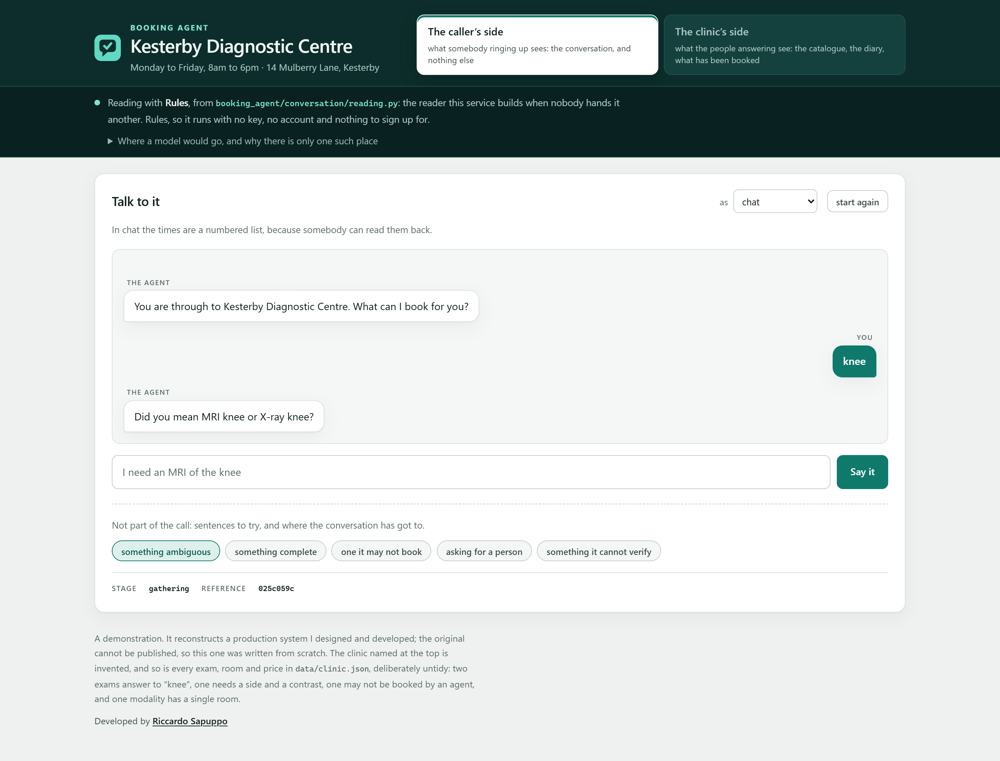
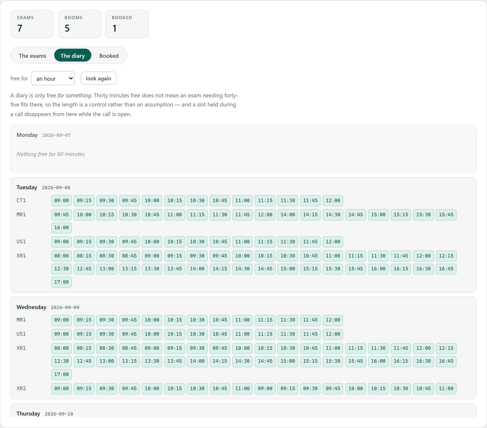
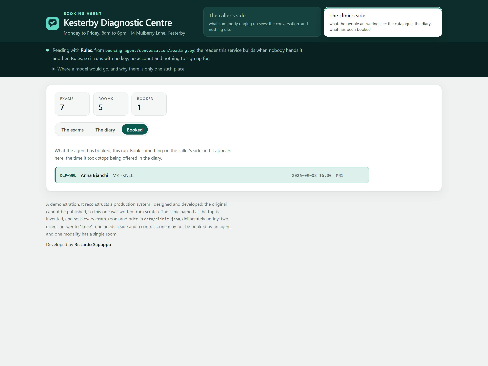
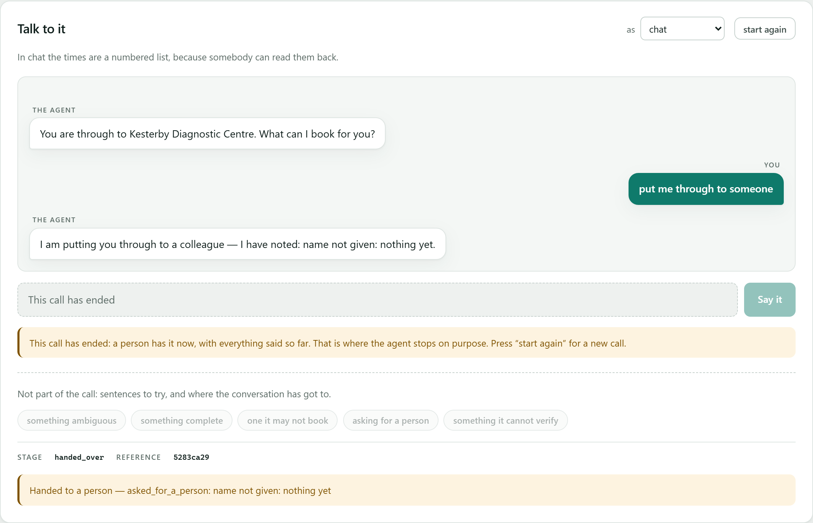

# Conversational booking agent

An agent that takes booking calls for a diagnostic clinic. Somebody says "I need
an MRI of the knee", and between that and an appointment there are questions to
ask, an exam to identify out of several that answer to the same word, a slot to
hold while they decide, and a set of situations where the right thing to do is
to stop and fetch a person.

## Before you start

**Python 3.10 or newer**, and nothing else. No database, no message broker, no
container, no account, no API key, and no model — the agent runs on rules, and
that is a decision rather than a stage it has not reached yet.

Check what you have with `python --version`. On Windows the command is often
`py` rather than `python`; on Linux and macOS it may be `python3`.

**Measured, not estimated:** the five pinned packages bring **43 distributions**
in with them and take **49 MB** on disk, installed once from PyPI. That is the
entire network cost — nothing reaches out again afterwards, at any point, for
any reason.

**Install into a virtual environment** — `python -m venv .venv`, then activate
it — so that undoing all of this is deleting `.venv/` and the clone. Nothing
here writes outside its own folder, registers a service, or touches anything
global.

## Running it

```
git clone https://github.com/riccardosapuppo/conversational-booking-agent
cd conversational-booking-agent
pip install -r requirements.txt

python -m booking_agent.service
```

That opens the console on <http://127.0.0.1:8000>: the agent on the left, and
the clinic it is booking in on the right, at the same time.



**The layout is the argument.** An agent offering "Monday at 09:15" is only
interesting if you can look across, see that 09:15 was free, and then watch it
stop being free. So the diary is open beside the conversation rather than
somewhere else, and the exam list is searched with **the agent’s own search** —
not a filter written for the screen, which would be a second thing to keep in
step and the one that quietly stopped agreeing.

**Nothing on that page books anything.** Every booking goes through the
conversation, which is where the rules that guard it live; a screen with its own
path to the diary would be the path nobody tested. The views it reads are
read-only, and a test tries every other verb on each of them.

The browser is not opened in CI, with no terminal attached, or with `--no-open`
(or `NO_OPEN=1`), and it says which of those happened.

### Or at a prompt

```
python -m tools.talk
```

Five packages are installed, all of them pinned in
[requirements.txt](requirements.txt): LangGraph for the conversation graph,
FastAPI, uvicorn and pydantic for the HTTP service, and httpx for the tests.
It said four until somebody counted the file. Then type at it:

```
  agent : You are through to Example Clinic. What can I book for you?

  you   : knee

  agent : Did you mean MRI knee or X-ray knee?

  you   : the mri one

  agent : Left or right?

  you   : left, no contrast

  agent : And what name should I put it under?

  you   : Anna Bianchi

  agent : I have these:
          1) Monday 07 September at 09:00
          2) Monday 07 September at 09:15
          3) Monday 07 September at 09:30
          Which suits you?

  you   : the second

  agent : Anna Bianchi: MRI knee left without contrast, on Monday 07 September
          at 09:15. Shall I book that?

  you   : yes

  agent : Booked: Anna Bianchi: MRI knee left without contrast, Monday
          07 September at 09:15. Your reference is M6H-FWV.
```

The same call on the telephone, with `python -m tools.talk --voice`:

> The first is Monday the seventh of September at nine o'clock in the morning.
> The second is Monday the seventh of September at nine fifteen in the morning.
> […] Your reference is M 6 H dash F W V. That is M 6 H dash F W V, once more.

## What it is careful about

**It does not guess.** Two exams answer to "knee", so it asks which. An
exam that has a left and a right is not booked without one. Not understanding
is an answer, and it is the answer that ends with a person on the line — an
agent that guesses produces a confident booking for the wrong thing, and the
caller finds out on the day.

**A slot offered is a slot held.** A conversation takes minutes. Between "there
is a nine o'clock on Tuesday" and "yes, that one" somebody checks with their
partner and finds their prescription. Without a hold, two people are told about
the same slot and one of them arrives to find it gone.

**It knows what it may not do.** CT angiography is in the catalogue so it can be
found and explained, not hidden so the clinic looks as if it does not do it —
and it is handed to somebody who can arrange it, with the reason. Somebody
ringing about an appointment they already have gets a person, because the agent
has no way to know they are who they say they are.

**It gives up on purpose.** Two turns of not being understood, three sets of
times nobody likes, nothing free in a fortnight: each one ends with a named
reason and a note the person taking over can read before they say hello. "The
agent gave up" is not something anybody can act on.

**A reference is for the person it is given to.** Two groups of three, from an
alphabet with no O or I — heard as zero and one — no 0, 1, 5 or 8 — heard back
as O, I, S and B — and no vowels, so six random characters cannot spell
anything the clinic would rather read out. Out loud it is spelled and then
repeated. It used to be the first twelve characters of a uuid: unique, correct,
and unusable by the person it was for.

## The console

Until it existed, the only way to see this agent work was to install Python and
type at a prompt — which meant most people who might want to see it never would.
It is the same agent over the same endpoints, with three things beside it.

**What is free, for how long.** A diary is only free *for something*: thirty
minutes free does not mean an exam needing forty-five fits there. So the length
is a control rather than an assumption, and changing it changes what is offered.



**What it has booked, and what that cost the diary.** Book something on the left
and it appears on the right — and the time it took stops being offered.



**Where it stops.** A handover is not an error and is not drawn as one. It is
the agent doing the most useful thing available to it, and the reason travels
with it.



### The buttons say what they do, and are checked against it

The page offers a handful of sentences to try, each labelled with what it
demonstrates. That is a promise, and a promise on a page is worth what the check
behind it is worth — so each button carries a `data-expect`, and
[a test](tests/test_looking.py) says its sentence to the real agent and fails if
what comes back is not what the label claims.

That is not a precaution. The first version of that list had a button labelled
*"something it must not answer"* whose sentence the agent answered quite happily
— it has no rule about clinical questions and never claimed one — and another
naming an exam this clinic does not have. Both looked entirely convincing until
somebody pressed them, and a screenshot is what pressed them.

## How it is put together

```
booking_agent/
  clinic/        what is offered, and when it is free
    catalogue.py   exams, and the search from what somebody said
    diary.py       sessions, free slots, holds, bookings
    build.py       a clinic from the file that describes one
  conversation/  what to say next
    state.py       what is known so far, and what is still missing
    reading.py     what one message appears to mean
    graph.py       the flow, as a LangGraph graph
  channels/      how to say it
    chat.py        for a screen
    voice.py       for somebody who cannot look back
  service/       the outside world, and the only clock in the building
```

Nothing above imports anything below it, and [a
test](tests/test_service.py) fails if a domain package ever learns the word
`fastapi`. The direction of that dependency is the design, and it is exactly
the kind of thing one convenient import undoes.

### The conversation graph


Drawn by `python -m tools.diagram`, from the graph rather than from memory —
[a test](tests/test_diagram.py) fails if a node is added here and forgotten
there, because a hand-drawn picture of a graph is accurate exactly once.

Every node ends the turn. The graph is entered once per message and not run to
completion, because a booking conversation does not finish on its own: it
waits, and waiting is its normal state. What each node does is one thing —
`clarify` asks for exactly one missing piece, `hold` keeps a slot, `handover`
writes the note the person taking over will read.

Three consequences worth naming:

- **The flow is one function.** `_route` in `graph.py` is the whole of what the
  agent decides, top to bottom, and every node can be run against a state built
  by hand in three lines. The thing this replaces had one node with two and a
  half thousand lines inside it, which is a way of saying it had no graph at
  all.
- **Nothing reads the clock.** The time is passed in everywhere below
  `service/`, so a hold running out mid-sentence is a three-line test rather
  than a ten-minute wait.
- **Language is in one file.** `reading.py` is the only part with an opinion
  about what English means. The default reader is rules, not a placeholder for
  a model: a demonstration that needs a key before it does anything is a
  demonstration nobody runs, and logic that can only be exercised through a
  model is logic that is not tested.

## Checking it

```
python -m unittest discover -s tests -t .   # 144 tests
python -m tools.transcripts                 # whole conversations
python -m tools.transcripts --show          # and read them
python -m tools.screenshots                 # retakes the pictures above
```

`tools.screenshots` drives **Microsoft Edge**, already on this machine, through
Playwright — `pip install -r requirements-checks.txt`. It is not in CI, which
has no browser, and it says so and stops rather than reporting a success it did
not earn. It is also what pressed the buttons that turned out to be lying.

The tests were written alongside the code they test, which makes them good at
saying it still does what it did and poor at saying it does what a caller
needs. So `data/conversations/` holds whole calls — one caller line per line —
and the tool reports only how each one ended: booked, handed to a person with a
reason, answered, or **stuck**, which means the agent went round in circles.

The first time it ran, four of the eight were stuck, against seventy passing
tests. Among what it found: a synonym reading "scan of the tummy" had put the
words *of* and *the* into an exam's vocabulary, so a caller who said "it's
about the thing" was understood to want an abdominal ultrasound and was asked
for their name. Point it at your own folder with `python -m tools.transcripts
path/to/folder`.

## The service

```
python -m booking_agent.service      # http://127.0.0.1:8000/docs
```

Localhost only, with no default that reaches further.

| | |
|---|---|
| `POST /calls` | start one. `{"channel": "chat"}` or `"voice"` |
| `POST /calls/{call}/said` | `{"text": "..."}` → the reply, the stage, whether it is over |
| `GET /calls/{call}` | where it has got to, without moving it on |
| `DELETE /calls/{call}` | hang up |

And the clinic, read-only — what the console draws on the right:

| | |
|---|---|
| `GET /clinic` | who this is, and which rooms it has |
| `GET /catalogue?q=` | every exam, or the ones a phrase finds. **The agent’s own search** |
| `GET /diary?days=&minutes=` | what is free, by day and by room, *for that length* |
| `GET /bookings` | what the agent has booked, this run |

None of them changes anything, and a test tries every other verb on each to
keep it that way.

Calls are held in memory and let go of after an hour of silence. The booking is
the thing worth keeping, and the diary already has it.

## The clinic

`data/clinic.json` describes a clinic that does not exist. It is deliberately
untidy, because a tidy catalogue demonstrates nothing: an exam that needs both
a side and a contrast, two that answer to "knee", one the agent may not book,
one long enough that a free room is not enough for it, one modality with a
single room. [A test](tests/test_build.py) fails if somebody tidies it up.

**Long enough, measured:** the MRI room is open **09:00 to 13:00** on a Monday,
one unbroken stretch, and across it the diary offers the **30**-minute knee
scan **15** start times and the **75**-minute whole spine **12**. Noon is free
in an empty diary and will not take the spine — being free is not the question,
being free for long enough is. The same test works those figures out again from
the file and fails when this paragraph stops agreeing with them: a number
copied into prose is right on the day it is copied.

Replace it with your own and pass it to either entry point with `--clinic`.

## What it does not do

No model, no speech, no telephony, and no database — a restart forgets the
diary. Reading is rules, which is enough for the sentences in
`data/conversations/` and will not survive everything a real switchboard hears;
the `Reader` protocol in `reading.py` is one method wide, so a model-backed
reader is a new class and no change to anything else. That was the point of
putting the boundary there.

---

Developed by Riccardo Sapuppo. MIT licensed.
